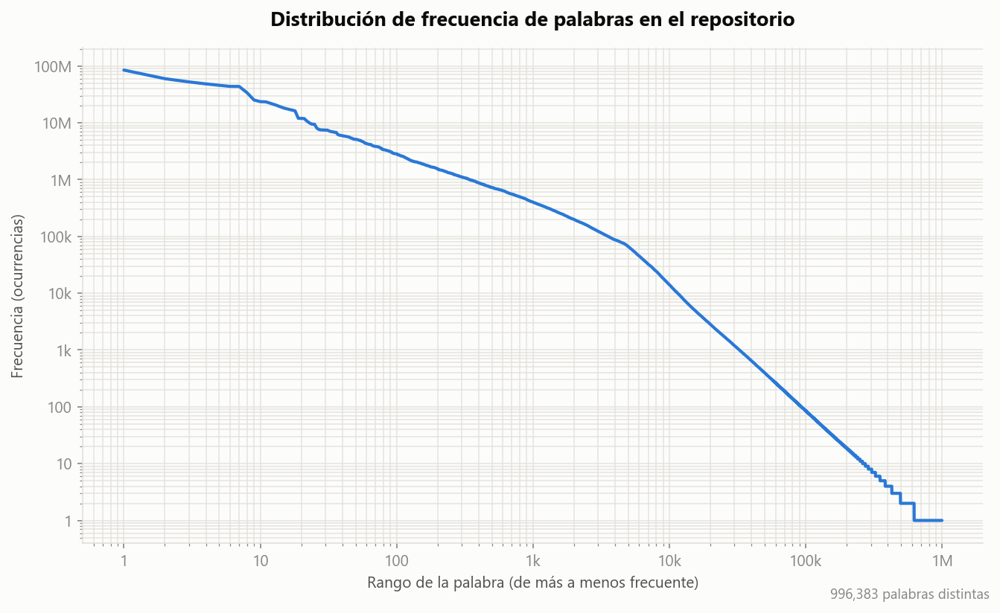
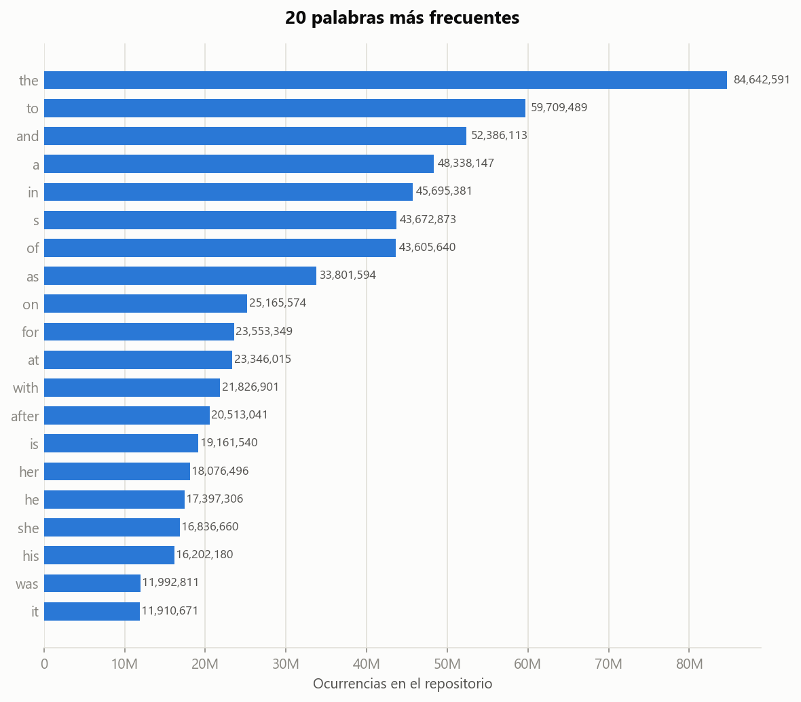

# Proyecto 1 - Arañador

## Integrantes

- Daniel de Jesús Alemán Ruiz | 2023051957
- Sebastián Rodríguez Sánchez | 2023074446

## Información del curso

- **Curso:** IC8060 - Recuperación de Información Textual
- **Profesor:** Aurelio Sanabria Rodríguez
- **II Semestre, 2026**

---

## Necesidad de información

### Tema

**Premier League** — la primera división del fútbol profesional inglés.

### Características de la información

El buscador recolecta información textual relacionada con la Premier League, incluyendo:

- Noticias y crónicas de partidos
- Resultados y calendario de partidos
- Tabla de posiciones
- Estadísticas de jugadores y equipos (goles, asistencias, tarjetas, minutos jugados)
- Fichajes y rumores de transferencias
- Lesiones y estados físicos de jugadores
- Entrevistas y declaraciones de jugadores, entrenadores y directivos
- Historia y perfiles de clubes

### Tipo de consultas esperadas

- "Resultado del último partido del Liverpool"
- "Goleadores de la temporada actual"
- "Próximos partidos de la jornada X"
- "Últimos fichajes del Chelsea"
- "Historial de enfrentamientos entre dos equipos"
- "Posición actual del Arsenal en la tabla"

### Caracterización del colectivo

- **Rango etario:** principalmente entre 15 y 45 años.
- **Contexto socioeconómico:** heterogéneo, audiencia global de aficionados al fútbol, no limitada al Reino Unido.
- **Subtemas de interés:** fantasy football, apuestas deportivas, transferencias, historia y rivalidades entre clubes.
- **Consultas esperadas por el colectivo:** seguimiento en tiempo real de resultados y tablas, comparación de estadísticas de jugadores, noticias del equipo de preferencia del usuario.

---

## URLs semilla

El listado completo de URLs semilla (22, superando el mínimo de 10 pedido), usado como insumo directo por ambos arañadores, se encuentra en [`seeds.txt`](seeds.txt).

Estas URLs son únicamente el punto de partida: el arañador extrae los enlaces internos de cada página visitada (a otras noticias, partidos, perfiles de jugadores, etc.) y los sigue recursivamente según la política de expansión (ver siguiente sección), lo que permite alcanzar miles de páginas dentro de los dominios semilla y así llegar al tamaño de repositorio requerido.

---

## Políticas de arañado

### 1. Política de expansión (frontera de arañado)

**Descripción:** a partir de cada URL semilla, el arañador extrae los enlaces internos del mismo dominio (o subdominios permitidos) y los agrega a la cola de arañado, hasta una profundidad máxima configurable o hasta agotar contenido nuevo relevante al tema.

**Justificación:** con solo 10 semillas no se alcanza el volumen de 10GB requerido; la necesidad de información (noticias, estadísticas, perfiles) está distribuida en cientos de páginas internas de cada sitio, no solo en la portada.

**Metadatos a almacenar:** URL origen (de dónde se extrajo el enlace), profundidad respecto a la semilla.

### 2. Política de priorización por recencia

**Descripción:** las páginas con contenido de publicación reciente (noticias, resultados) se priorizan en la cola de arañado sobre contenido histórico o estático (perfiles de clubes, reglamentos).

**Justificación:** el colectivo objetivo espera información actualizada (resultados, fichajes recientes); priorizar recencia maximiza la relevancia del repositorio para las consultas esperadas.

**Metadatos a almacenar:** fecha de publicación (extraída del HTML o inferida), fecha de arañado.

### 3. Política de filtrado por relevancia temática

**Descripción:** solo se descargan páginas cuyo contenido esté relacionado con Premier League (se descartan, por ejemplo, secciones de otros deportes o de otras ligas dentro del mismo sitio). Además de filtrar por palabras clave en el texto y el path, se descartan subdominios de servicio no editoriales (empleos, tienda, viajes, cuentas de usuario, portales regionales genéricos) aunque el dominio principal esté permitido.

**Justificación:** evita contaminar el repositorio con texto fuera de la necesidad de información definida, y evita gastar ancho de banda/tiempo en contenido irrelevante. El filtro de subdominios se agregó tras observar en pruebas reales que dominios permitidos como `theguardian.com` o `espn.com` exponen subdominios ajenos al tema (`holidays.theguardian.com`, `fantasy.espn.com`) que consumían presupuesto de arañado sin aportar contenido relevante. Del mismo modo, las URLs semilla se validaron y ajustaron con base en corridas reales: se descartaron dominios que bloquean el arañado por completo (`robots.txt` restrictivo o bloqueo anti-bot HTTP 403) y se corrigieron rutas semilla que devolvían HTTP 404.

**Metadatos a almacenar:** categoría/sección detectada, palabras clave usadas para el filtrado.

### 4. Política de cortesía (crawling ético)

**Descripción:** respetar las reglas de `robots.txt` de cada dominio, aplicar un delay mínimo entre solicitudes al mismo dominio, y limitar la cantidad de conexiones concurrentes por sitio.

**Justificación:** evita sobrecargar los servidores de terceros y respeta los términos de uso de cada sitio, es una práctica estándar documentada en la literatura de web crawling.

**Metadatos a almacenar:** timestamp de cada request, código de respuesta HTTP, tiempo de respuesta.

### 5. Política de deduplicación

**Descripción:** un mismo partido o noticia suele cubrirse en múltiples fuentes o reaparecer en distintas URLs del mismo sitio, se descartan documentos cuyo contenido textual sea altamente similar a uno ya almacenado.

**Justificación:** maximiza la diversidad de información del repositorio y evita inflar artificialmente el tamaño con contenido repetido.

**Metadatos a almacenar:** hash del contenido (para comparación rápida), URL(s) duplicadas detectadas.

---

## Estadísticas del repositorio

El repositorio final combina lo descargado por ambos arañadores (propio y Scrapy), ejecutados en paralelo sobre las mismas 22 semillas durante aproximadamente 180 horas.

| Métrica | Valor |
|---|---|
| Tamaño total del repositorio (texto limpio) | 15.12 GB |
| Cantidad de documentos | 1,440,556 |
| Cantidad de palabras (ocurrencias totales) | 2,693,195,808 |
| Palabras distintas | 996,383 |
| Documentos con fecha de publicación extraída | 1,132,599 (78.6%) |

### Distribución por sitio (top 15)

| Sitio | Documentos | Tamaño |
|---|---|---|
| dailymail.com | 183,348 | 9,615.6 MB |
| goal.com | 154,925 | 346.8 MB |
| mirror.co.uk | 139,100 | 668.3 MB |
| liverpoolecho.co.uk | 113,517 | 589.2 MB |
| manchestereveningnews.co.uk | 110,001 | 565.4 MB |
| bbc.com | 103,744 | 916.0 MB |
| birminghammail.co.uk | 88,337 | 424.4 MB |
| transfermarkt.com | 74,398 | 211.7 MB |
| chroniclelive.co.uk | 74,306 | 381.2 MB |
| standard.co.uk | 71,975 | 262.8 MB |
| espn.com | 68,670 | 183.9 MB |
| caughtoffside.com | 55,081 | 135.0 MB |
| teamtalk.com | 43,388 | 189.6 MB |
| independent.co.uk | 41,287 | 227.9 MB |
| theguardian.com | 33,751 | 234.1 MB |

`dailymail.com` concentra más de la mitad del tamaño total del repositorio con solo el 12.7% de los documentos (~52KB promedio por documento, frente a ~11KB del resto); su plantilla de artículo incluye bastante texto adicional (resúmenes, listas relacionadas) que el extractor conserva por no estar marcado como navegación.

### Curva de frecuencia de palabras

La primera gráfica ordena las 996,383 palabras distintas de más a menos frecuente (eje X) contra cuántas veces aparece cada una en todo el repositorio (eje Y), ambos en escala logarítmica. La línea casi recta que se forma es exactamente lo que predice la **ley de Zipf**: en cualquier texto en lenguaje natural, unas pocas palabras (artículos, preposiciones) concentran la mayoría de las apariciones, mientras que la inmensa mayoría de las palabras distintas aparece muy pocas veces (la cola larga de la derecha). Que la curva del repositorio siga este patrón es una buena señal de que el texto extraído es lenguaje natural real y no basura de HTML, menús o código mal limpiado.

La segunda gráfica muestra las 20 palabras más repetidas. Todas son *stopwords* del inglés (the, to, and, a, in...), y eso es el resultado esperado, no un error: **a propósito no se filtraron stopwords para esta estadística**, porque la ley de Zipf se demuestra justamente con ellas, son las que arman la curva de la primera gráfica. Quitarlas tendría sentido si esta cifra fuera insumo para un índice de búsqueda o para comparar temas entre documentos, pero no para medir la frecuencia de palabras de la colección completa como pide esta sección.

---